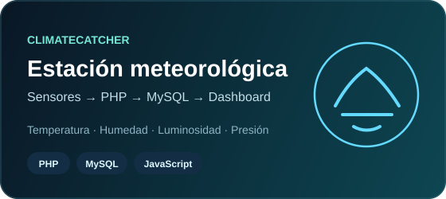
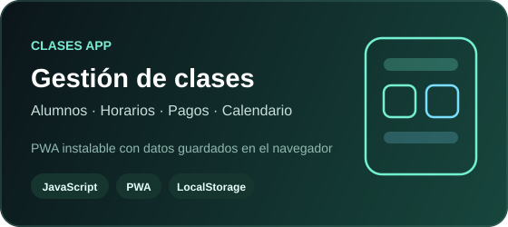

  

## Hola, soy Alejo 👋

Trabajo con desarrollo web y me gusta armar proyectos donde pueda conectar la interfaz con la lógica, los datos y, en algunos casos, hardware.

Acá voy subiendo los proyectos que fui desarrollando y que quiero conservar bien documentados. Trabajo principalmente con **JavaScript, HTML, CSS, PHP y MySQL**, y también vengo usando **PWA, LocalStorage, Node.js** e integración con dispositivos.

## Tecnologías

  
  
  
  
  
  
  
  

## Proyectos

  
  

<strong>Ver un poco más sobre cada proyecto</strong>

### ClimateCatcher

Una estación meteorológica conectada a una aplicación web. La estación envía **temperatura, humedad, luminosidad y presión**; la web guarda esos datos y permite ver registros, estadísticas, gráficos y reportes en PDF.

- PHP + MySQL para backend y datos.
- Chart.js para gráficos.
- Sesiones de usuario y panel de administración.
- Recepción de mediciones desde la estación.

[Ir al repositorio](https://github.com/alejoesp/ClimateCatcher)

### Clases App

Una aplicación para organizar **alumnos, horarios, clases y pagos**. Tiene agenda semanal, asistencia, reprogramaciones, combos de horas, calendario y control de saldos.

- JavaScript sin frameworks.
- Datos guardados con LocalStorage.
- Service Worker y Web App Manifest.
- Instalación como PWA.

[Ir al repositorio](https://github.com/alejoesp/clases-app)

## También me interesa

- desarrollo web;
- bases de datos;
- aplicaciones que funcionen offline;
- automatización;
- visualización de datos;
- integración con hardware e IoT.
