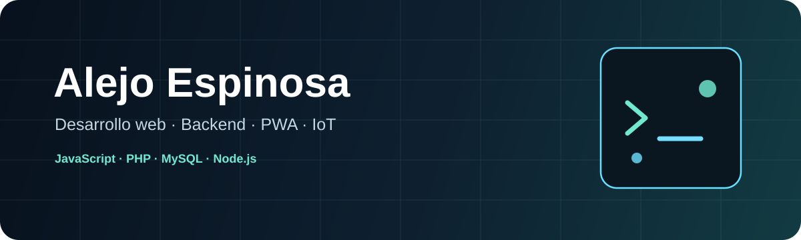

  

## Hola, soy Alejo 👋

Trabajo con desarrollo web y me gusta armar proyectos donde pueda conectar la interfaz con la lógica, los datos y, en algunos casos, hardware.

Acá voy subiendo los proyectos que fui desarrollando y que quiero conservar bien documentados. Trabajo principalmente con **JavaScript, HTML, CSS, PHP y MySQL**, y también vengo usando **PWA, LocalStorage, Node.js** e integración con dispositivos.

## Tecnologías

  
  
  
  
  
  
  
  

## Proyectos

<table>
<tr>
<td width="50%" valign="top">

### 🌦️ ClimateCatcher

Una estación meteorológica conectada a una aplicación web.

La estación envía **temperatura, humedad, luminosidad y presión**. Los datos se guardan en MySQL y desde el dashboard se pueden consultar registros, estadísticas, gráficos y reportes en PDF.

**PHP · MySQL · JavaScript · Chart.js · FPDF**

[Ver ClimateCatcher →](https://github.com/alejoesp/ClimateCatcher)

</td>
<td width="50%" valign="top">

### 📚 Clases App

Una aplicación para organizar **alumnos, horarios, clases y pagos**.

Tiene agenda semanal, asistencia, reprogramaciones, combos de horas, calendario y control de saldos. Guarda los datos en el navegador y se puede instalar como PWA.

**JavaScript · HTML · CSS · PWA · LocalStorage · Node.js**

[Ver Clases App →](https://github.com/alejoesp/clases-app)

</td>
</tr>
</table>

## También me interesa

- desarrollo web;
- bases de datos;
- aplicaciones que funcionen offline;
- automatización;
- visualización de datos;
- integración con hardware e IoT.
